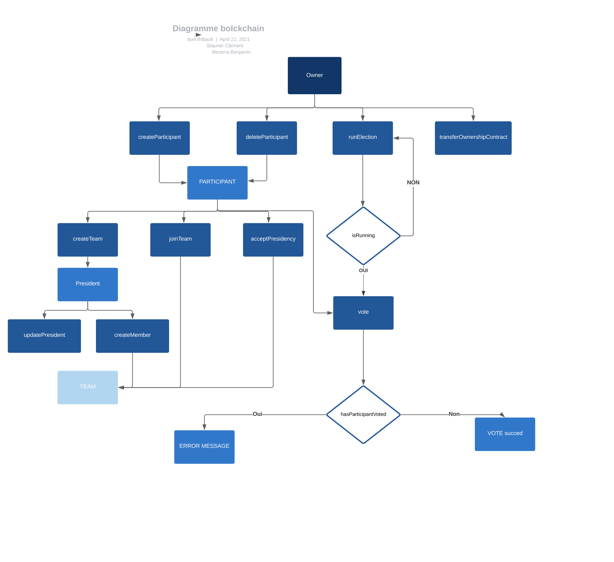

# Elections

## Class

- Contract
- Participant
- Team

## Function

### OnlyOwner

- transferOwnershipContract: public Ownable
- createParticipant: public Ownable
- deleteParticipant: public Ownable
- runElection: public Ownable

### Only president

- updatePresident: public Participant
- createTeamMember: public Participant

#### Everyone

- vote: public Participant
- createTeam: public Participant
- joinTeam: public Participant
- acceptPresidency: public Participant

### Information

- isMember
- isTeamVotable
- hasParticipantVoted
- updateParticipant
- hasElectionStarted
- isElectionRunning

## Updates

### Libraries

- OpenZeplin: whitelist.sol
